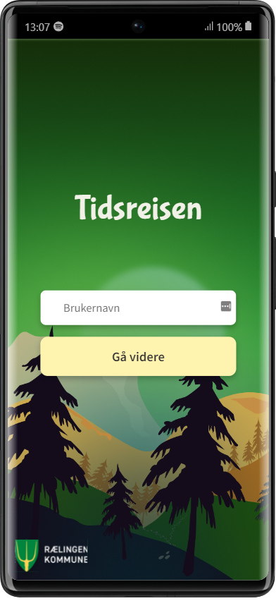
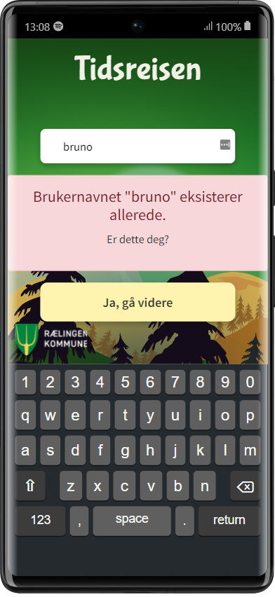
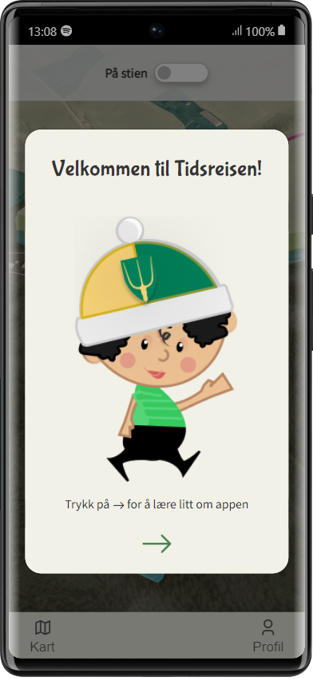
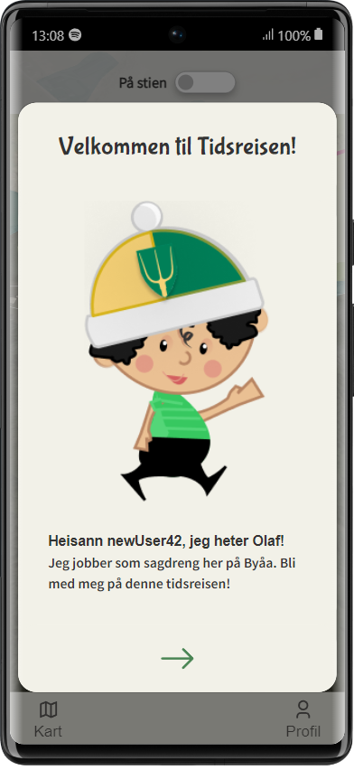
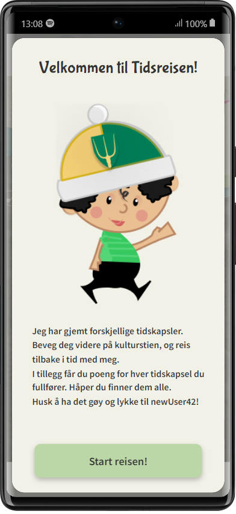
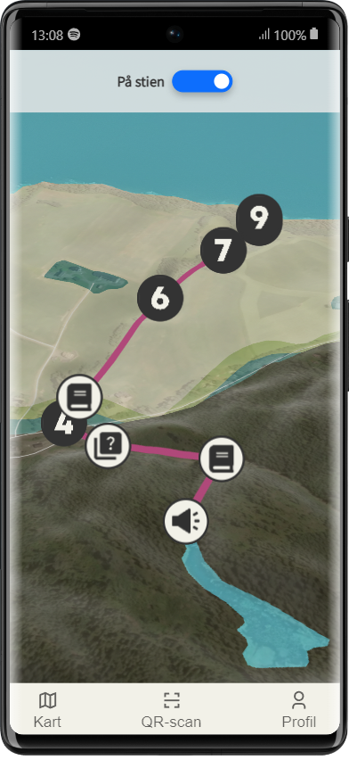
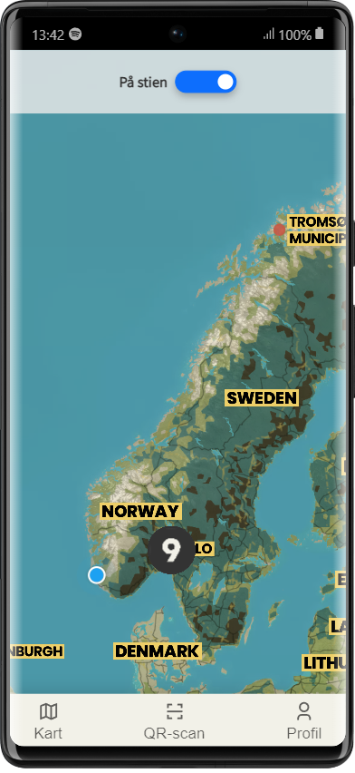
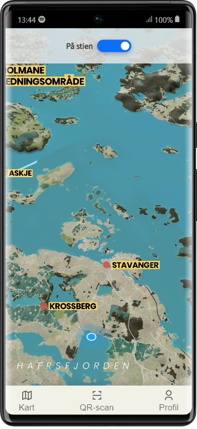
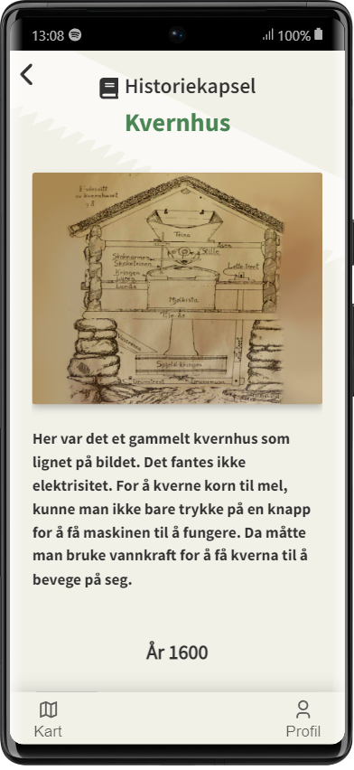
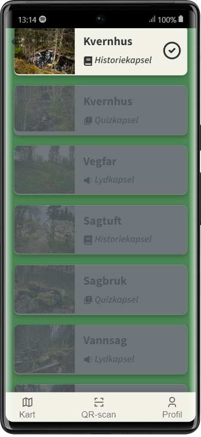

> PRO201 Agile (Smidig) Project exam   > [Class description](https://www.kristiania.no/en/syllabus/school-of-economics-innovation-and-technology/first-cycle-degree/pro201/agile-project/)   > [App @ Heroku PaaS](https://tidsreisen.herokuapp.com/)

<h1 align="center">
Tidsreisen Byåa 🚶‍♂🚩🌲🗺
</h1>

This application was made by a group of 8 and were graded to an A.

> _How can we develop a service that provides visitors
> a cultural-historical experience of Byåa 350 years ago
> engaging, through a mobile app?_

---

# Tidsreisen - a learning app for primary school students

- **Cultural historical path** - QR codes, information given in text, images and audio called _history, quiz_ and _audio capsules_.
- **GPS location** - Real time GPS tracking to be used while walking on the path, so the user can watch where to go and interact with the app with map features.
- **Classroom** - As well as working in the classroom with map interaction if GPS is turned off.

---

	<h4>1. Start screen</h4>
	

		
		
	

	<h4>2. Introduction</h4>
	

		
		
		
	

	<h4>3. Map</h4>
	

		
		
		
	

	<h4>4. History capsule</h4>
	

		
	

	<h4>5. My findings page</h4>
	

		
	

